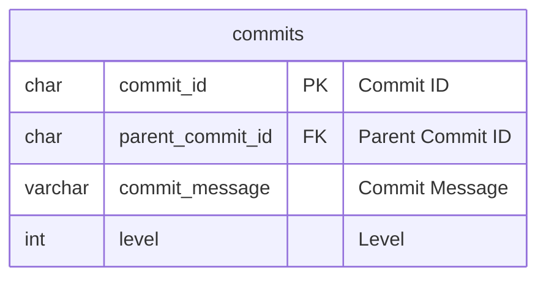

# 木構造データのRDBでの取り扱いに関するテスト

## Research Question

木構造データをRDBに格納する際は次のようなDB構造をとることとなる。



しかし、ある先頭ハッシュに対する一連データを取得する場合、再帰的な処理が必要と見られた。

再帰的な処理を許容することがどれだけパフォーマンスに対して影響を及ぼすかが、本レポジトリのResearch Questionである。

## Procedure

1. `make launch` でMySQLインスタンスを起動する
2. `setup.sql` でDBの立ち上げを行う
3. `inflate-data.sql` で木構造データの生成をひたすら行う
4. `query.sql` で生成した木構造データに対するクエリを実行、パフォーマンスを検証する

## Result

### TL;DR

木構造データを再帰的な処理が必要となる形で入れても、
再帰クエリを使用していればパフォーマンス的にも影響なく実行可能である。

### Explanation

以下のクエリは、末端ハッシュノード(先頭ノード)に対してその一連の系列を取得するクエリである。

| ヒット件数 | 実行時間       |
|-------|------------|
| 100件  | 35\~45ms程度 |
| 200件  | 35\~55ms程度 |
| 250件  | 40\~60ms程度 |

```SQL
WITH RECURSIVE commit_tree AS
                   (SELECT *
                    FROM commits
                    WHERE commit_id = '398fb57621e8cb491e808d41f862185df346d1f3'
                    UNION ALL
                    SELECT c.*
                    FROM commits c
                             INNER JOIN commit_tree ct ON ct.parent_commit_id = c.commit_id)
```

以下のクエリは、ルートのノードから子ノードを全て取得するクエリである。

このクエリを実行すると、数万件の結果を得られることがあるが、その場合でも高々20秒程度で収まった。

```SQL
WITH RECURSIVE commit_tree AS
                   (SELECT *
                    FROM commits
                    WHERE commit_id = 'eecce4095730595a050d11e1d1a9e904fd72a59f'
                    UNION ALL
                    SELECT c.*
                    FROM commits c
                             INNER JOIN commit_tree ct ON ct.commit_id = c.parent_commit_id)
```

